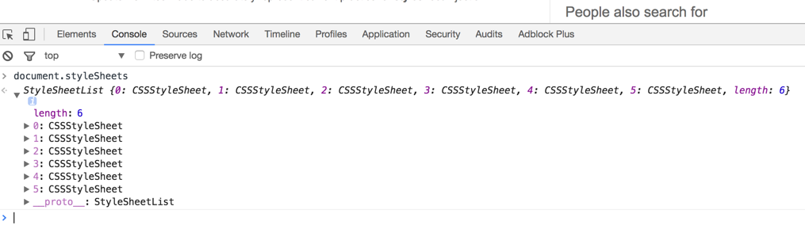
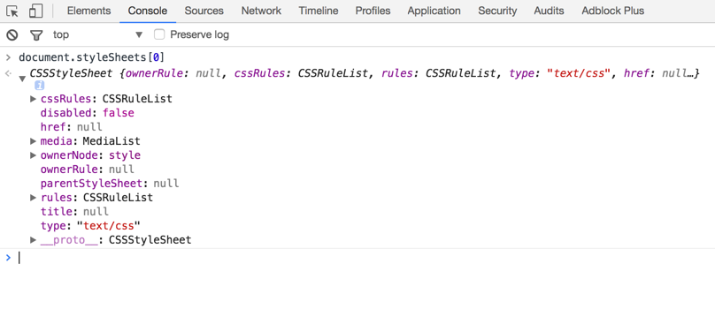

# 概要

https://www.w3.org/TR/cssom-1/
# style
style是用来控制dom样式的属性. 必须强调一下, 这个是DOM的属性. 因此, 他只能获取其属性上的值.

```javascript
 var box = document.querySelector(".box")
 box.style.color = "red"
 box.style.backgroundColor = "white"
 console.log(box.style)
```

# stylesheet
document.stylesheets

```javascript

 console.log(document.stylesheets)

```
打印出来的是css style列表, 包含style元素的, 也包含link方式的样式表

这个对象是一个类似数组的形式.


所以里面的每一个对象都是CSSStyleSheet对象, 那我们重点来研究这个对象

```javascript
  console.log(document.stylesheets[0])
```

我们重点来看下他们的属性

属性 | 作用 | 备注
---- | ---- | ----
cssRules|  样式内容 |   |
rules | 样式内容   |    |
href | 样式表链接 | 如果是Link则href存在, cssRules, rules为Null
type | 类型, 一般是"text/css" | |
ownerNode | 节点, 一般为style, link | |
ownerRule | 如果一个样式表示通过@import 规则引入document的，则ownerRule将返回那个CSSImportRule对象，否则返回null ||
parentStyleSheet | 如果有的话, 返回包含这个得stylesheet, 若果没有, 返回null| |
media | 代表样式信息的目标介质 | MediaList对象
title | 样式标题 | |
disable | 代表当前样式是否被使用 | 布尔类型值 |

方法 | 作用 | 备注
---- | ---- | ----
addRule | 添加规则||
insertRule(rule, index) | 插入规则 | myStyle.insertRule("#blanc { color: white }", 0);
removeRule | 移除规则||
deleteRule(index) | 删除规则||


## CSSRuleList
这个对象有一个属性
### CSSStyleRule
属性 | 作用 | 备注
----|----|----
cssText | 样式内容, 文本形式存在 | 属性可读可写
selectorText | 选择的样式选择器 ||
style | ||
type | ||
parentRule | ||
parentStyleSheet| ||

## MediaList
属性 | 作用 |
---- | ---- |
mediaText | 字符串内容 |
item | getter DOMString? item(unsigned long index);
appendMedium |  void appendMedium(DOMString medium);
deleteMedium |  void deleteMedium(DOMString medium
