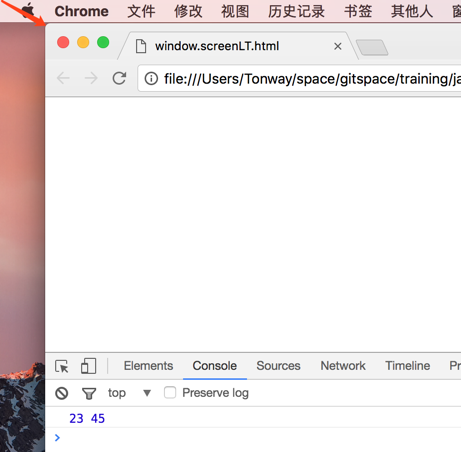
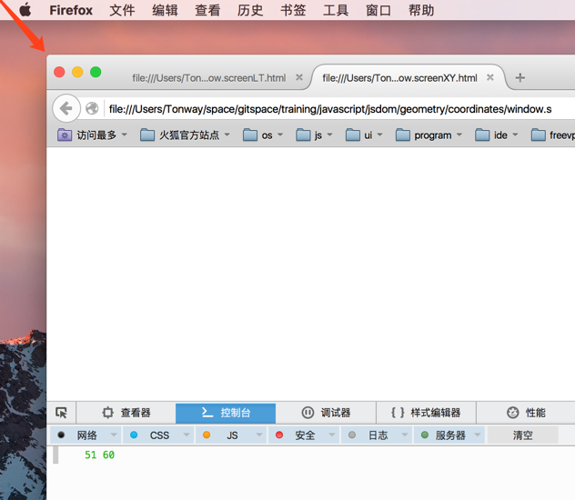
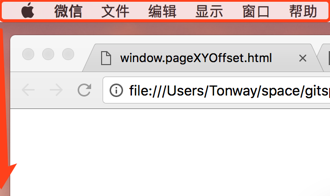
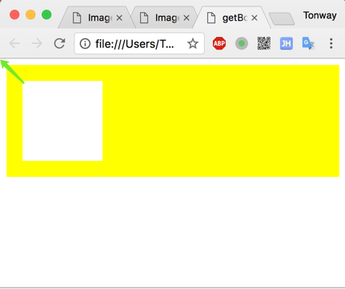
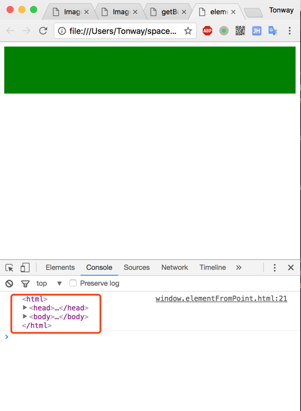
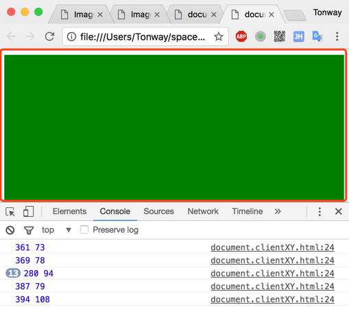
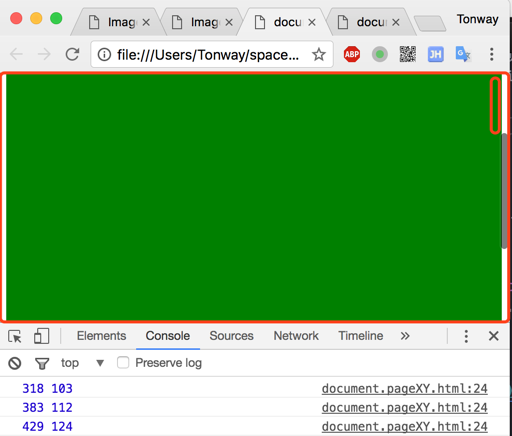
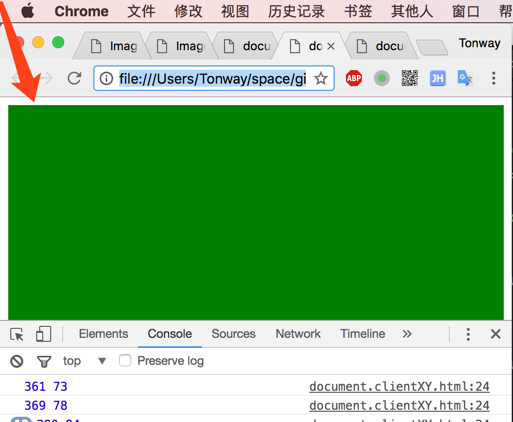
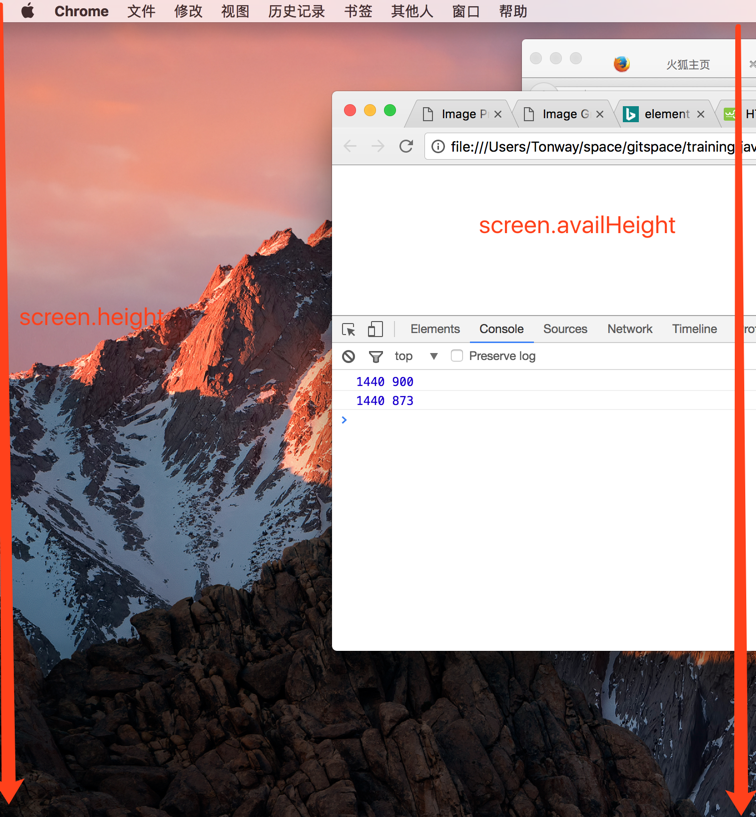

<!-- TOC depthFrom:1 depthTo:6 withLinks:1 updateOnSave:1 orderedList:0 -->

- [概要](#概要)
- [坐标](#坐标)
	- [window坐标](#window坐标)
		- [screenLeft, screenTop](#screenleft-screentop)
		- [screenX, screenY](#screenx-screeny)
		- [scrollX, scrollY](#scrollx-scrolly)
		- [pageXOffset, pageYOffset](#pagexoffset-pageyoffset)
		- [screen.availLeft, screen.availTop](#screenavailleft-screenavailtop)
		- [getBoundingClientRect()](#getboundingclientrect)
		- [elementFromPoint(x, y)](#elementfrompointx-y)
		- [postition:fixed](#postitionfixed)
	- [document坐标](#document坐标)
		- [针对于事件机制坐标](#针对于事件机制坐标)
			- [e.clientX, e.clientY](#eclientx-eclienty)
			- [e.pageX, e.pageY](#epagex-epagey)
			- [e.screenX, e.screenY](#escreenx-escreeny)
			- [e.layerX, e.layerY](#elayerx-elayery)
			- [e.x, e.y](#ex-ey)
			- [e.offsetX, e.offsetY](#eoffsetx-eoffsety)
		- [正对于DOM坐标机制](#正对于dom坐标机制)
			- [elem.clientTop, elem.clientLeft](#elemclienttop-elemclientleft)
			- [elem.offsetTop, elem.offsetLeft, elem.offsetParent](#elemoffsettop-elemoffsetleft-elemoffsetparent)
			- [elem.scrollLeft, elem.scrollTop](#elemscrollleft-elemscrolltop)
- [宽度和高度 (width, height)](#宽度和高度-width-height)
	- [window中的宽度和高度](#window中的宽度和高度)
		- [innerWidth, innerHeight](#innerwidth-innerheight)
		- [outerWidth, outerHeight](#outerwidth-outerheight)
		- [screen.availWidth, screen.availHeight](#screenavailwidth-screenavailheight)
		- [screen.width, screen.height](#screenwidth-screenheight)
	- [document中的高度和宽度](#document中的高度和宽度)
		- [elem.clientWidth, elem.clientHeight](#elemclientwidth-elemclientheight)
		- [elem.offsetWidth, elem.offsetHeight](#elemoffsetwidth-elemoffsetheight)
		- [elem.scrollWidth, elem.scrollHeight](#elemscrollwidth-elemscrollheight)
		- [elem.getBoundingClientRect().width, elem.getBoundingClientRect().height](#elemgetboundingclientrectwidth-elemgetboundingclientrectheight)
		- [getComputedStyle(elem).width, getComputedStyle(elem).height](#getcomputedstyleelemwidth-getcomputedstyleelemheight)
- [scroll 滚动](#scroll-滚动)
	- [window中滚动](#window中滚动)
	- [document中的滚动](#document中的滚动)

<!-- /TOC -->


# 概要
在javascript中, 我们还包含了几何学相关的内容. 这里我们从三个方面入手: 坐标, 大小, 滚动.


# 坐标
* 相对于window
* 相对于文档

坐标能做什么?
1. 弹出框的定位
2. 标签的定位
3. 滚动插件
4. more............

## window坐标
window坐标, 是相对于可视化窗口而言. 可视化窗口就是浏览器中, 可显示出来的内容

### screenLeft, screenTop
坐标点以屏幕左上角为原点.
这里需要注意的, 在谷歌浏览器中存在, 火狐里不存在. 存在兼容性问题

* screenLeft - 浏览器离屏幕左边的距离

* screenTop -  浏览器离屏幕顶部的距离

```javascript
var x = window.screenTop;
var y = window.screenLeft;

console.log(x, y)
```



### screenX, screenY
与上面的功能类似, 坐标以屏幕左上角为原点.
这两个属性, 在火狐和谷歌中都存在.

* screenX -  浏览器离屏幕左边的距离

* screenY -  浏览器离屏幕顶部的距离

```javascript
var x = window.screenX;
var y = window.screenY;

console.log(x, y)
```



### scrollX, scrollY
浏览器出现滚动条时候出现
浏览器 | 是否兼容 | 解决方案
----- | ----   | ----
谷歌   |  是    |  &nbsp;
火狐   |  是    |  &nbsp;
这里需要注意的是这**两个属性都需要在文档加载完后调用**, 代码放在文档底部也没用

* scrollX - 浏览器水平滚动条最左边离浏览器的左边

* scrollY - 浏览器水平滚动条最顶部离浏览器的顶部
```javascript
window.onscroll = function () {
   var x = window.scrollX;
   var y = window.scrollY;
   console.log(x, y)
}
```

### pageXOffset, pageYOffset
这个功能与scrollX, scrollY 类似, 这个属性在火狐中, 需要在文档加载完后调用

* pageXOffset - 浏览器水平滚动条最左边离浏览器的左边

* pageYOffset - 览器水平滚动条最顶部离浏览器的顶部

```javascript
window.onscroll = function () {
   var x = window.pageXOffset;
   var y = window.pageYOffset;
   console.log(x, y)
}
```


### screen.availLeft, screen.availTop
这个是屏幕有效区域到屏幕的顶部, 左边的位置
```javascript
   var x = window.screen.availLeft;
   var y = window.screen.availTop;
   console.log(x, y);
```


### getBoundingClientRect()
* top - 元素顶部到窗口顶部
* left - 元素左边到窗口左边
* right - 元素右边到窗口左边
* bottom - 元素底部到窗口顶部

```javascript
//这里会报错, 因为这个方法压根就不是window的.
//console.log(window.getBoundingClientRect())
var rect = document.querySelector(".rect");

//getBoundingClientRect是元素的方法, 得到一个ClientRect对象,
//那为什么会拿到window来讲呢?
var bound = rect.getBoundingClientRect();

console.log(bound)


var inner_bound = document.querySelector(".inner").getBoundingClientRect();

console.log(inner_bound)
```



他们的共同点都是针对window上的坐标原点来计算.
- [x] 通过这四个属性, 可以算出元素的宽度和高度

  >width = right - left
  >
  >height = bottom - top

- [x] 当出现滚动时, window坐标也会随之改变
- [x] 坐标可以为小数, 也可以为负数


### elementFromPoint(x, y)

这个方法主要作用是返回某个坐标点所在的标签元素, 这个点也是针对window的左上角为原点.

> var elem = document.elementFromPoint(x, y)

看下一个简单例子:
```javascript
var ele = document.elementFromPoint(10, 90);
console.log(ele)
```
这里我们获取的是(10, 90), 获取到的是html文档标签
结果如下:


从这个字面意义就可以看出来这个意思, 比如我们获取窗口中间的元素

> var cx = document.documentElement.clientWidth / 2;

> var cy = document.documentElement.clientHeight / 2;

> var elem = document.elementFromPoint(cx, cy)

以下为null的情况:

- [x] 坐标为负数
- [x] 坐标超出了可见区域

### postition:fixed
大多数时候, 我们需要通过坐标来设置某些元素的位置, 在CSS中, 我们使用position:fixed的left,top或者right, bottom.
我们通过一个例子来, 理解这个.
例子: 我们有一个按钮, 当点击按钮的时候, 在按钮的下方显示一个提示语. 这个例子也是我们可以经常看到的.
```html

<button>点击我</button>
```

```javascript
  <script>
      var button = document.querySelector("button");

      function showTips() {
          var rect = button.getBoundingClientRect();
          var tip = document.createElement("div");
          tip.style.cssText = "position: fixed; color: red";
          tip.textContent = "我是提示文字";
          tip.style.top = rect.bottom + "px";
          tip.style.left = rect.left + "px";
          document.body.appendChild(tip);
      }
      button.onclick = function() {
          showTips();
      }
  </script>
```

但是这个例子, 如果内容出现滚动条时, 提示语的位置, 也会随之变动. 如果我们想让他一直保持在原来的位置, 那我们就需要的是获取position: absolute的left, top或者right, bottom

## document坐标

### 针对于事件机制坐标
相对于document的坐标, 是从文档的左上角算起, 不是窗口, 在CSS中, window相对于position:fixed, 而document则是position:absolute, 它俩也就得区别对待.
在window中获取坐标clientX, clientY, 在document中使用pageX, pageY. 他们俩有什么不一样呢?
>1. 没有滚动条时, 它俩的坐标是一样的
>2. 有滚动条时, 它俩也就不一样了

#### e.clientX, e.clientY

针对浏览器可视窗口,点击所在位置到可视窗口的原点处

```javascript
document.body.onclick = function(e) {
   console.log(e.clientX, e.clientY);
}
```




#### e.pageX, e.pageY
针对内容占用区域, 点击所在位置到文档原点处
```javascript
document.body.onclick = function(e) {
  console.log(e.pageX, e.pageY);
  console.log(e.clientX + document.body.scrollLeft, e.clientY + document.body.scrollTop);
}
```
这里包含了滚动的区域.可以得出:
> e.clientX + elem.parentNode.scrollLeft = e.pageX

> e.clientY + elem.parentNode.scrollTop = e.pageY



#### e.screenX, e.screenY
针对显示器屏幕, 点击所在位置到屏幕的原点处. 针对可见窗口的区域.
```html
<!DOCTYPE html>
<html>
  <head>
    <meta charset="utf-8">
    <title></title>

   <style media="screen">
         html {
           height: 100%;
           background-color: #fff;
         }
         body {
           height: 800px;
           background-color: green;
         }
   </style>

  </head>
  <body>

  </body>
</html>
```

```javascript
document.body.onclick = function(e) {
    console.log(e.screenX, e.screenY)
}
```


#### e.layerX, e.layerY
针对内容占用区域, 点击所在位置到最近的position元素(包含它自己)的原点处. 这里我们针对目标元素而言.
从layer的意义来说, 是针对某一层来说.
```javascript
document.body.onclick = function(e) {
    console.log(e.layerX, e.layerY)
}
```

#### e.x, e.y
针对浏览器可视窗口,点击所在位置到可视窗口的原点处

```javascript
document.body.onclick = function(e) {
    console.log(e.x, e.y)
}
```

#### e.offsetX, e.offsetY
针对当前点击所在位置到最近目标对象(当前元素)的原点而言

```javascript
document.body.onclick = function(e) {
    console.log(e.offsetX, e.offsetY)
}
```

### 针对于DOM坐标机制

#### elem.clientTop, elem.clientLeft
这里的clientLeft, clientTop, 分别是该元素的border-left, border-top.

```javascript
var rect = document.querySelector(".rect")
console.log(rect.clientLeft, rect.clientTop)
```

#### elem.offsetTop, elem.offsetLeft, elem.offsetParent
offsetTop, offsetLeft都是针对offsetParent而言. 默认情况下, offsetParent是body.
如果改变offsetParent, 使用的是position: absolute/relative...


```javascript
var rect = document.querySelector(".rect")
console.log(rect.offsetTop, rect.offsetLeft)
console.log(rect.offsetParent)

```


#### elem.scrollLeft, elem.scrollTop
这两个属性都是可读可写的. 所以可以用他们来控制滚动条的滚动.
这两个属性保证有效的话, 必须要出现滚动条.

```javascript
window.onload = function() {
    var rect = document.querySelector(".rect")
    console.log(rect.scrollTop, rect.scrollLeft)
}
```

> **提示**
> 在火狐中document.body直接对应的是window的scroll, 在代码中直接获取scroll是为0的, 需要将获取的信息, 放置在window.onload函数中


# 宽度和高度 (width, height)
在浏览器中, 操作width, height主要是对window窗口, 以及文档, 文档元素的操作.比如对象, window, document, Element
## window中的宽度和高度

### innerWidth, innerHeight
浏览器内部窗口宽度和高度.
```javascript
   console.log(window.innerWidth, window.innerHeight)
```

### outerWidth, outerHeight
整个浏览器的可视宽度和高度
```javascript
   console.log(window.outerWidth, window.outerHeight)
```
### screen.availWidth, screen.availHeight
屏幕中有效的宽度和高度
```javascript
console.log(window.availWidth, window.availHeight)
```

### screen.width, screen.height
整个屏幕的宽度和高度
```javascript
console.log(window.width, window.height)
```



## document中的高度和宽度
每一个元素, 都会有自己的宽度和高度


```html

<div class="box">
    flksdjflskdjflksdjfklsdjflksdjflksdlfjksdlkfs
    flksdjflksdjflksjdflksjdlfsd
    fksdljflksdjflksdjflksdjflkjsd
    fskldjflskdjflksdjflkjsd
    fsdlkfjsdlkfjsldkfjsd
    fskdlfjskldjfsd
    fskdjlfjsldjflskdjlfs
    fsdklfjsdlkfjsldkj
</div>

```

```css
.box {
    margin:50px auto;
    height: 100px;
    width: 200px;
    overflow: auto;
    padding: 10px;
    border: 10px #ff0033 solid;
}
```


```javascript
var box = document.querySelector(".box");


console.log(box.clientWidth, box.clientHeight)
console.log(box.offsetWidth, box.offsetHeight)
console.log(box.scrollWidth, box.scrollHeight)


var brect = box.getBoundingClientRect();
console.log(brect.width, brect.height);

var bcrect = getComputedStyle(box);
console.log(bcrect.width, bcrect.height)
```
### elem.clientWidth, elem.clientHeight
元素内容的可视的宽度和高度, 包含padding, 不包含border, 滚动条的宽度

### elem.offsetWidth, elem.offsetHeight
offsetWidth, offsetHeight包含了width, border, padding

### elem.scrollWidth, elem.scrollHeight
包含滚动内容大小, 也就是实际内容宽度和高度. 包含padding, 不包含border
### elem.getBoundingClientRect().width, elem.getBoundingClientRect().height
这个类似offsetWidth, offsetHeight

### getComputedStyle(elem).width, getComputedStyle(elem).height
获取内容的大小, 一般是css设置的属性, 获取到的是字符串, 带像素单位


# scroll 滚动
滚动在网页中, 是必不可少的组件.内容比如设备高度小于内容高度时,就需要滚动来显示隐藏的内容. 在网页中又区分窗口的滚动方式和元素内容的滚动.但是他们的操作方式又有所不一样.这里我们就来学习他们的使用方式.

## window中滚动
scrollX, scrollY是获取滚动的位置. 他们只能获取, 不可写
```javascript
console.log(scrollX, scrollY)
```
下面是来设置滚动的方式:

* scroll(), scrollTo()
这两个都是传递x, y坐标,绝对位置的坐标. 这两个功能是一样的
```javascript
//移动10个高度
window.scroll(0, 10)
```
* scrollBy()
是相对位置, 以起点开始, 相对于这个点, 移动的位置距离(dx, dy)
```javascript
//移动10个高度
window.scrollBy(0, 0);
window.scrollBy(0, 10);
```

## document中的滚动
scrollTop, scrollLeft 两个属性是可读可写的.所以获取滚动的大小, 和设定滚动位置都是由他们两来操作.

```javascript

console.log(elem.scrollTop, elem.scrollLeft)

elem.scrollLeft = 100
elem.scrollTop = 100
```

* elem.scrollIntoView(true/false)
将元素滚动到可见区域.
```javascript
var box = document.querySelector(".box");
box.scrollIntoView();
```
true: 元素的顶端与当前窗口的顶部对齐
false: 元素的底端与当前窗口的顶部对齐


`[TOC]`
