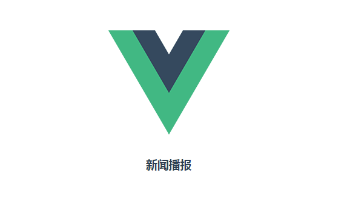
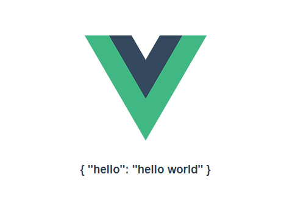

# Keep Learning Vuejs 2.0

## vue介绍

Vue.js 是一套构建用户界面的渐进式框架。与其他重量级框架不同的是，Vue 采用自底向上增量开发的设计。Vue 的核心库只关注视图层，它不仅易于上手，还便于与第三方库或既有项目整合。另一方面，当与单文件组件和 Vue 生态系统支持的库结合使用时，Vue 也完全能够为复杂的单页应用程序提供驱动。

> 官方网站： <https://vuejs.org>

> 中文站： <https://cn.vuejs.org>

## vue特点

1. 响应界面
2. 数据绑定
3. 指令
4. 模板
5. 组件
6. 事件处理
7. 计算属性
8. css动画
9. 自定义过滤

## Vue.js的使用

1. 在HTML文件中插入

  <script>
  </script>

  标签

  ```html
  <script src="https://unpkg.com/vue"></script>
  ```

2. 通过NPM安装使用

3. 使用vue-cli工具创建

4. 通过使用bower来安装使用

## VUE-CLI实现

这里我们推荐使用Vue-cli命令行工具来创建项目 有时候在输入npm install 时不会安装依赖组件，这时候可以设置环境变量 NODE_ENV=development

> npm install -g Vue-cli

> vue init webpack demo

> cd demo

> npm install

> npm run dev

> npm run build

附加资料

<https://github.com/vuejs/vue-cli>

<https://github.com/vuejs-templates/webpack>

## 基本语法

### 简单例子， 初始化vue

```html
<div id="app">${msg}</div>
```

```javascript
var vm = new Vue({
  el: "#app",
  data: {
    msg: "Hello, World"
  }
})
```

### 条件渲染

#### v-if

```html
<template>
   <div class="test">
     <h3>{{msg}}</h3>
     <p v-if="!islogin">你还未登录</p>
   </div>
</template>

<script>
export default {
  name: 'hello',
  data () {
    return {
      msg: '欢迎来到vuejs的世界',
      islogin: true
    }
  }
}
</script>
```

#### v-else

```html
<template>
   <div class="test">
     <h3>{{msg}}</h3>
     <p v-if="!islogin">你还未登录</p>
     <p v-else>你已经登录</p>
   </div>
</template>

<script>
export default {
  name: 'hello',
  data () {
    return {
      msg: '欢迎来到vuejs的世界',
      islogin: true
    }
  }
}
</script>
```

#### v-ele-if

```html
<template>
   <div class="test">
     <h3>{{msg}}</h3>
     <p v-if="state == 1">在家里睡觉</p>
     <p v-else-if="state == 2">在足球场踢球</p>
     <p v-else-if="state == 3">在网咖打竞技</p>
     <p v-else>在学校读书</p>
   </div>
</template>

<script>
export default {
  name: 'hello',
  data () {
    return {
      msg: '欢迎来到vuejs的世界',
      state: 3
    }
  }
}
</script>
```

上面的都是可以嵌套使用

#### v-show

`不支持template`

```html
<template>
  <section>
    <template v-if="isshow">
       <div class="test">
         <h3>{{msg}}</h3>
         <p>在学校读书
            <p v-show="isshow">展示效果</p>
         </p>
       </div>
    </template>

    <template v-else>
      <h5>hello h5</h5>
    </template>
  </section>
</template>


<script>
  export default {
    name: 'hello',
    data() {
      return {
        msg: '欢迎来到vuejs的世界',
        isshow: true
      }
    }
  }
</script>
```

### 对比v-if v-show

v-if 在运行时根据条件判断处理渲染，也就是会根据条件来添加或删除元素。 v-show 元素始终保持渲染在DOM中，修改的是元素style中display属性的值。

通常来讲，如果经常进行切换的话，使用v-show, 如果在运行时不常操作的话，使用v-if

### 循环

v-for

#### 数组

```html
<template>
   <section>
        <h3>{{msg}}</h3>
        <ul>
          <li v-for="(item, index) in likes" :key="index">
             {{item}} - {{index}}
          </li>
        </ul>
   </section>
</template>

<script>
  export default {
    name: 'hello',
    data() {
      let likes = ["篮球", "街舞", "唱歌"]
      return {
        msg: '欢迎来到vuejs的世界, for循环使用',
        likes: likes
      }
    }
  }
</script>
```

`改变数组` for中的in也可以用of来代替使用。

1. 数组中的数据修改，中括号是无法处理的, 中括号是改变了数据， 但是不会进行通知.
2. 可以通过Vue.set(数据，索引位置，新数据) -> this.$set(数据，索引位置，新数据).或者splice(索引位置, 1, 新数据)
3. 修改数组的长度也是不行的。处理方式可以通过splice(newlength)

`key`

代码中的key，是一个唯一标识， 代表着单个元素， 用来匹配某个数据。VUE中在组件是重复使用，来提高性能。 当数据改变时，会使用当前渲染好的组件。最好在使用迭代的过程中加入key作为一个唯一标识，免得数据错乱。 开发过移动端的界面，有所感悟。 key在react， 小程序等等中都有接触过。

#### 范围

```html
<template>
   <section>
        <h3>{{msg}}</h3>
        <ul>
          <li v-for="item in 10">
             {{item}}
          </li>
        </ul>
   </section>
</template>

<script>
  export default {
    name: 'hello',
    data() {
      return {
        msg: '欢迎来到vuejs的世界, for循环使用。'
      }
    }
  }
</script>
```

#### 对象

```html
<template>

<section>
    <h3>{{msg}}</h3>
    <ul>
        <li v-for="(value, key, index) in likes" :id="key">
            <a :href="key"> {{value}} - {{key}} - {{index}}</a>
        </li>
    </ul>

    <button type="button" name="button" v-on:click="change">改变</button>
</section>

</template>

<script>

export default {
    name: 'hello',
    data() {
        let person = {
          "name": "will",
          "age" : 18,
          "desc" : "coder"
        }
        return {
            msg: '欢迎来到vuejs的世界, for循环使用',
            likes: person
        }
    },
    methods: {
        change() {
          this.likes.name = "Peter"
        }
    }

}
</script>
```

## 事件处理

在VUE中， 对事件也有自己的独特封装。使用方式会比较简洁。我们来看最简单的方式。 其实我们之前已经使用到了点击事件。 比如

```html
<template>

<section>
    <h3>{{msg}}</h3>
    <button type="button" name="button" v-on:click="change">改变</button>
</section>

</template>

<script>

export default {
    name: 'hello',
    data() {
        return {
            msg: '欢迎来到vuejs的世界, 事件处理'
        }
    },
    methods: {
        change(e) {
            this.msg = "通过vuejs, 改变世界"
        }
    }

}
</script>
```

这种模式的回传递一个事件对象过来。我们还可以改为这种模式

```html
<button type="button" name="button" v-on:click="change('附加内容', $event)">改变</button>
```

```javascript
change(str, e) {
  this.msg = "通过vuejs, 改变世界" + str;
}
```

这样我们就可以在事件函数中传递值。但是这样的话，要获取原始事件对象，就通过$event作为参数传递到函数。

下面我们来学习一下事件修饰符。在我们原始事件中，我们会阻止一些默认事件。比如event.preventDefault() 或 event.stopPropagation()。当然在VUEJS中也可以这样使用。 不过VUEJS给了更加方便的使用方式。比如v-on:click.stop或者v-on:keyup.enter等等。修饰符也可以串联，如： v-on:click.stop.prevent或者v-on:click.prevent.stop。 这里注意一下串联的顺序不一样，其执行的结果也有所不同。 下面是一些修饰符 .stop .prevent .capture .self .once

包含键修饰符 v-on:keyup.13 这种后面跟键的数值， 这种方式记住键盘，会比较麻烦。VUE也提供了别名比如，v-on:keyup.enter,这种写法还可以简写成@keyup.enter 下面是别名 .enter .tab .delete (捕获 "删除" 和 "退格" 键) .esc .space .up .down .left .right

组合按键 .ctrl .alt .shift .meta 比如： @keyup.alt.21, @click.ctrl. 但是要注意一点事，键盘事件@key.alt这种形式，单纯按下alt是不会触发事件，需要配合其他按键

## 表单输入

表单主要是使用v-model来做数据绑定，也是双向绑定。我们通过下面的代码，来看看这些特性

```html
<section>
  <h3>{{msg}}</h3>

  <div class="select">
    <label for="">下拉框: </label>
    <select class="" name="" v-model="sct">
        <option value="" disabled>没有选择</option>
        <option value="1">第一个</option>
        <option value="2">第二个</option>
        <option value="3">第三个</option>
    </select>
    <p>选择的值： {{sct}}</p>
  </div>

<hr>

 <div class="radio">
   <label for="">radio: </label>
   <input type="radio" name="" value="m" v-model="sex"> 男
   <input type="radio" name="" v-model="sex" value="w">女
   <p>选择的值：{{sex}}</p>
 </div>

 <hr>

 <div class="checkbox">
   <label for="">checkbox: </label>
   <input type="checkbox" name="" v-model="like" value="dance">跳舞
   <input type="checkbox" name="" v-model="like" value="song"> 唱歌
   <p>选择的值： {{like}}</p>
 </div>


<hr>

<div class="input">
  <label for="">input:</label>
  <input type="text" name="" :value="nick" v-model.trim="fullname">
  <p>输入的值：{{fullname}}</p>
</div>

<hr>
<div class="textarea">
   <label for="">textarea: </label>
   <textarea name="name" rows="8" cols="80" v-model="person.intro"></textarea>
   <input type="number" v-model.number="person.age">
    <p>输入的值： {{person}}</p>
</div>

</section>
```

```javascript
export default {
    name: 'hello',
    data() {
        return {
            msg: '欢迎来到vuejs的世界, 事件处理',
            sct: 1,
            sex: "w",
            like: ['dance'],
            fullname: "Will Wu",
            nick: "Will",
            person: {
              "name":"Tom",
              "age": 18,
              "intro": "一个可以改变世界的人"
            }
        }
    },
    methods: {
        change(str, e) {
            console.log(e)
            this.msg = "通过vuejs, 改变世界" + str
        }
    }

}
```

## 样式处理

样式处理，是用来处理class属性值， 以及style属性值。方便逻辑选择样式。

```html
<template>

<section>
  <h3 class="red">{{msg}}</h3>
  <p class="normal test" :class="{active:isact, red: haserr}">this is test</p>
  <p :class="[style$act, style$red, style]">this is an array</p>
  <p :class="[isact?style$act: '', style]">exp in array</p>
</section>

</template>

<script>

export default {
    name: 'hello',
    data() {

        return {
            msg: '欢迎来到vuejs的世界, 事件处理',
            isact: true,
            haserr: true,
            style$act: 'active',
            style$red:  'red',
            style:['test', 'hello']
        }
    },
    methods: {
    }

}
</script>

<style>
  .red {
    color: #ff0000;
  }
  .active {
    color: green;
  }
</style>
```

style的用法与class雷同。在style中，属性值还可以是数据。比如display: ['-webkit-flex', 'flex'], 这个用于不同浏览器中使用的属性值，不一样的方式。 class和style的属性值，也适用于计算属性。

## 计算属性

`computed {Object}`

```html

<template>

<section>
  <h3 class="red">{{msg}}</h3>
  <p>Time: {{time}}</p>
  <p>Name: {{fullName}}</p>

  <input type="text" v-model="firstName">
</section>

</template>

<script>

export default {
    name: 'hello',
    data() {
        return {
            msg: '欢迎来到vuejs的世界, 事件处理',
            firstName: "Will",
            lastName: "Wu"
        }
    },
    computed: {
       time: function(){
          return Date.now();
       },
       fullName: function(){
         return this.firstName + " " + this.lastName;
       }
    },
    methods: {

    }

}
</script>
```

这里我们也可以修改fullName的值，计算属性fullName的方式就这样来处理

```javascript
fullName:{
  get: function(){
     return this.firstName + " " + this.lastName;
  },
  set: function(newval) {
     console.log(newval)
  }
}
```

像之前那种方式是相当于调用了fullName的get函数，这个我们还可以进行set。这是object里的get,set

## watcher

`watch {Object}`

```html

<template>

<section>
  <h3 class="red">{{msg}}</h3>
  <p>Time: {{time}}</p>
  <p>Name: {{fullName}}</p>

  <input type="text" v-model="firstName">
</section>

</template>

<script>

export default {
    name: 'hello',
    data() {
        return {
            msg: '欢迎来到vuejs的世界, 事件处理',
            firstName: "Will",
            lastName: "Wu"
        }
    },
    computed: {
       time: function(){
          return Date.now();
       },
       fullName: function(){
            return this.firstName + " " + this.lastName;
       }
    },

    watch: {
      //监听firstname属性的改变
      firstName: function(newval) {
          console.log(newval)
      }
    }

}
</script>
```

## 组件开发

在VUE中每一个.vue文件, 都是一个组件。当然这种事需要编译的文件。如果用我们一般的形式写代码的话，通过Vue.component()方法来定义。 组件是在父组件之前创建

### 组件的使用

引入JS文件方式的使用

```javascript
Vue.component("comp", {
  props: {

  },
  template: '<div id="item">template</div>', //模板内容

  components: {

  },
  data:{

  },
  methods: {

  },
  computed: {

  },
  watch: {

  }
  ......
})
```

在界面中使用

```html
<div id="vuejs">
   <comp></comp>
</div>
```

我们也可以在父组件中进行创建模板

```javascript
Vue.component("item", {
  components: {
    "comp": '<div id="item">template</div>'
  }
})
```

### props属性

props的属性是单向流。从父组件传递内容给子组件。 使用方式很简单，就式给组件自定义属性，这个属性的值，由子组件来获取

```html
<template id="">
    <section>
         <h3>{{message}}</h3>
    </section>
</template>

<script>
  export default {
     name: "subcomp",
     props: {
        message: ""
     }
  }
</script>
```

父组件调用

```html
  <div id="app">
      <subcomp message="i'm parent"></subcomp>
  </div>
```

props属性也可以通过绑定来传递动态数据

```html
  <div id="app">
      <subcomp :message="parentMsg"></subcomp>
  </div>
```

props的属性还可以限定数据的类型

```javascript
props: {
  message: {
    type:String,
    default: "", //default还可以是函数
    required： true, //必须的
    validator(val){
       //自定义验证函数
    }
  },
  propb : [String, Number] //多个类型
}
```

限定数据类型中，主要有以下类型： String，Number，Boolean，Function，Object，Array，Symbol

### 不在props中定义的属性

我们也可以设定不是props得属性

```html
<section link="http://www.youtube.com" class="sub">
     <h3>{{message}}</h3>
</section>
```

父组件

```html
<div id="app">
    <subcomp message="i'm parent" link="http://www.google.com" class="hello"></subcomp>
</div>
```

这样子， class则会合并为hello sub, link直接被父组件的值覆盖

### 自定义事件

$on - 绑定事件 $emit - 触发事件 自定义事件，由着两个函数来处理。我们来看两个例子。最后我们看个sync.

1. 下面是父子组件的事件处理。 父组件， 通过v-on:自定义事件名，来定义事件

```html
<div id="app">
  
   <h3>{{count}}</h3>
   <hello v-on:add="addfn"></hello>
</div>


<script>
  {
    data() {
      return {
        count: 0
      }
    },
    methods: {
      addfn() {
        this.count++
      }
    }
  }
</script>
```

子组件

```html
<template>

<section>
  <h3 class="red">{{msg}} {{test}}</h3>
  <button type="button" v-on:click="goadd">提交</button>
</section>

</template>

<script>

export default {
    name: 'hello',
    data() {
        return {
            msg: '欢迎来到vuejs的世界, 事件处理',
        }
    },
    props: {
      test: ""
    },
    methods: {
      goadd(){
        this.$emit("add")
      }
    }

}
</script>
```

通过$emit方法来触发自定义的事件。

1. 两个组件不是父子关系，而是独立的组件，如何进行事件通信

Hello组件

```javascript
created() {
  this.$root.$on("hello", function(val) {
    console.log("hello event", val)
  })
}
```

World组件

```javascript
gofn(){
    this.$root.$emit("hello", "test");
}
```

这个例子中，在hello中注册事件，在World中响应事件。这里用到了$root对象。 在VUE组件中， this只能代表当前组件对象，如果用自己来注册事件，在其他组件中，是寻找不到该事件。因此我们可以考虑顶级对象来注册监听。 如果两个组件都是是同一个父组件，也可以通过父组件来注册监听。另外我们可以给每一个组件设定一个ID(通过ref属性).

1. .sync

.sync 同步这一个其实是`v-bind:属性` 与自定义事件:`update:属性`的结合

```html
<div class="" :hello.sync="task"></div>
```

转换为

```html
<div class="" :hello="task" v-on:update.hello="val => task = val"></div>
```

如果要显示的调用方法可以执行： this.$emmit("update:属性", newvalue)

### 表单中的自定义事件，定制自己的v-model

```html
  <input type="text" v-model="nick">
```

可以转换为下面形式

```html
  <input type="text" :value="nick" @input="change">
```

v-model其实就是自定义一些数据绑定和事件数据绑定。

同理，我们也可以实现自己的v-model指令的绑定功能.在数据对象中有一个 model对象：

```javascript
model : {
  prop: 属性,
  event: 事件名
}
```

父组件

```html
    <h3>{{result}}</h3>
    <updown v-model="result"></updown>
```

子组件

```html
<template>
   <div>
      <a href="javascript:;" @click="jian">-</a>
      <strong>{{value}}</strong>
      <a href="javascript:;" @click="add">+</a>
   </div>
</template>

<script>
   export default {
      data() {
         return {
           value: 0
         }
      },
      props: {

        result: {
          type: Number,
          default: 0
        }
      },
      model: {
        prop: "result",
        event: "change"
      },
      name: "updown",
      methods: {
        add(){
           this.value++;
           this.$emit("change", this.value)
        },
        jian(){
          this.value--;
          this.$emit("change", this.value)
        }
      }
   }
</script>
```

### 通过slot来分配内容

上面我们讲的都是通过属性来进行组件交流。现在我们通过标签体来沟通，在VUE中使用slot来处理。

1. ok, 我们来看一个简单的例子， 你就会明白slot的作用 在子组件中， 我们加入一个slot标签，slot默认一个内容

```html
<section>
   <slot>默认情况下</slot>
</section>
```

父组件中，我们来这么调用

```html
<hello>
    <h3>新闻播报</h3>
</hello>
```

渲染后的结果  如果hello中没有内容体， 则默认情况下显示，子组件默认的数据

1. 同样我们可以为slot命名， 这样来定位内容 例如：

```html
<section>
   <slot name="nav">导航</slot>
   <slot>默认情况下</slot>
</section>
```

父组件中，我们来这么调用

```html
<hello>
    <div slot="nav">
      <ul>
        <li><a href="">首页</a></li>
      </ul>
    </div>

    <h3>新闻播报</h3>
</hello>
```

1. 我们还可以在父组件中获取子组件的临时定义属性。

子组件

```html
<section>
  <slot hello="hello world">文本默认内容</slot>
</section>
```

父组件

```html
<hello>
     <template scope="props">
         <h3>{{props}}</h3>
     </template>
</hello>
```

渲染效果为



理解这个后， 我们来看一个循环例子

在子组件中， 我们设定一个items数组，然后绑定到slot

```html

<template>
<section>
  <slot hello="hello world" :value="item" v-for="item in items">文本默认内容</slot>
</section>

</template>

<script>

export default {
    name: 'hello',
    data() {
      return {
        items:["1", "2", "3"]
      }
    }
}
</script>
```

父组件

```html
<hello>
     <template scope="props">
         <h3>{{props.value}}</h3>
     </template>
</hello>
```

结果显示为：


### 动态组件

动态组件也非常简单，就是使用一个component标签，然后通过v-bind:is="模板名"属性，动态的切换组件 我们还是通过代码更直观的展示

```html
<template>

<section>
    <component :is="view"></component>
</section>

</template>

<script>

export default {
    name: 'hello',
    data() {
      return {
         view: "about"
      }
    },
    components: {
      "home": {
        template: "<h1>我是home</h1>"
      },
      "about": {
        template: "<h1>关于我们</h1>"
      },
      "contact": {
        template: "<h1>联系我们</h1>"
      }
    }
}
</script>
```

我们绑定的view值是about， 这时候内容显示为about组件的内容。只要改变view变量的值， 内容就会被改变。这就是动态切换组件

在动态组件里还有一个避免组件重新渲染，还保留了一个keep-alive标签。使用方式如下:

```html
<keep-alive>
  <component :is="view">
    <!-- 非活动组件将被缓存！ -->
  </component>
</keep-alive>
```

## 完整代码讲解

1. 目的

2. 布局

3. 结构

4. 代码

5. 效果

<http://svencreations.com/stomp/index-youtube-countdown.html>

## 其他工具和插件

vue-router - 官方路由插件 vue-resource 处理网页请求 vue-async-data - 异步数据加载 vue-validator - 表单验证插件 vue-devtools - 谷歌开发工具扩展 vue-touch - 手势插件（hammerjs） 更多的 <https://github.com/vuejs/awesome-vue#components--libraries>
